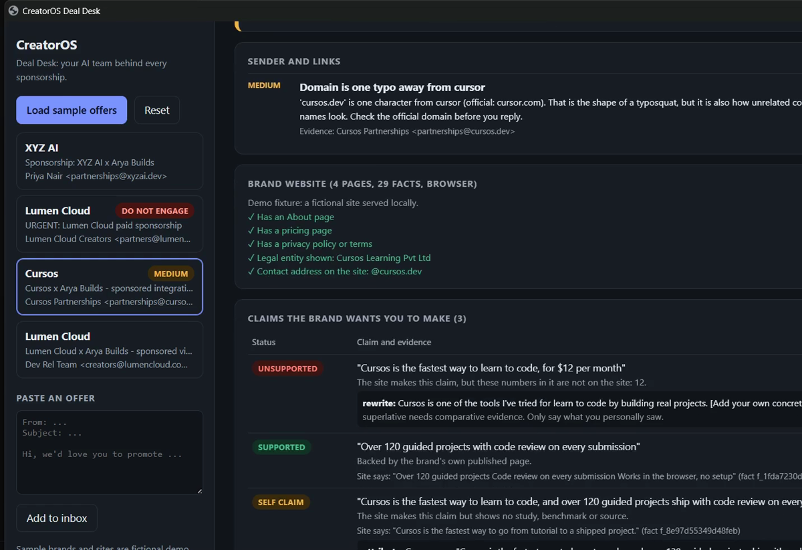
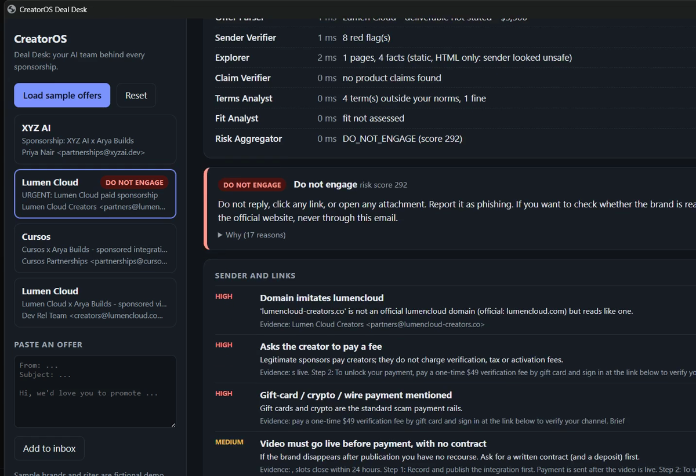
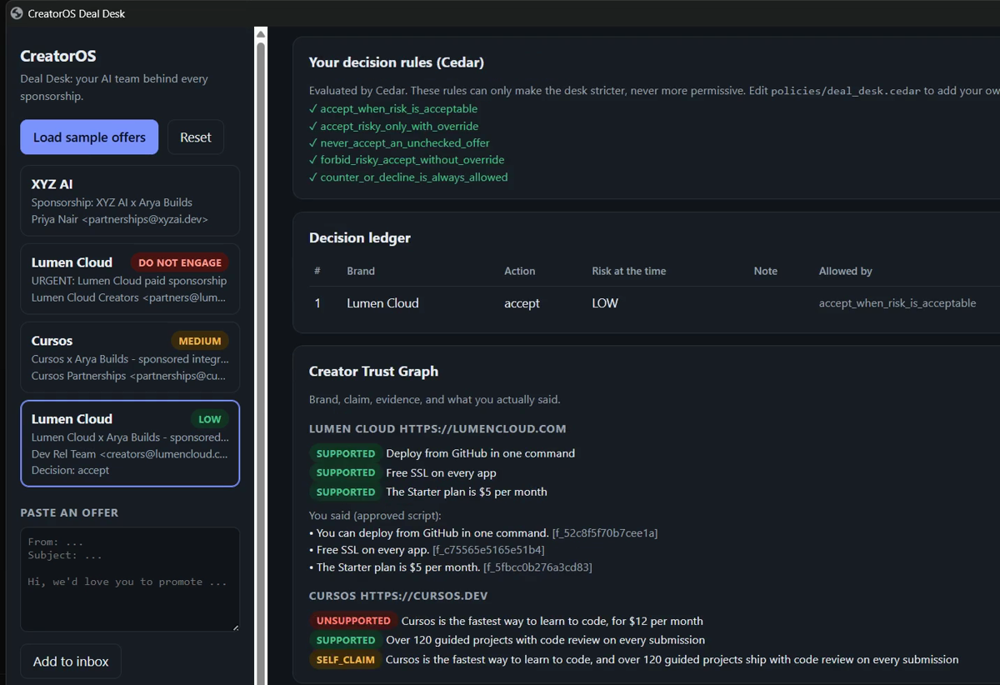

<div align="center">

# CreatorOS Deal Desk

### Verify a sponsorship offer before you say yes.

[](tests/)
[](https://www.python.org/)
[](https://www.cedarpolicy.com/)
[](https://playwright.dev/)
[](LICENSE)
[](SUBMISSION.md)

**No API keys · fully deterministic · nothing is ever sent or published automatically**

[Why](#why-this-exists) · [It works on the real internet](#it-works-on-the-real-internet-not-just-the-demo) · [Quick start](#quick-start) · [The agents](#the-agents) · [Where AWS fits](#where-aws-fits-cedar) · [What we measured](#what-we-measured) · [Honest limits](#honest-limits)

### [▶ Watch the 2-minute demo](https://youtu.be/bK3wQKxDuXw)



</div>

---

A creator gets a brand email. Before they trust it, the Deal Desk checks the sender for scam patterns,
crawls the brand's website in a real browser, verifies every claim the brand wants them to say against
the brand's *own* published pages, compares the terms with that creator's personal limits, and returns
one evidence-backed verdict. The creator decides. If they accept, it builds a compliance checklist and
drafts a sponsor segment using only the claims that survived verification.

**Nothing is ever sent or published automatically.** No API keys. Fully deterministic, so every verdict
is repeatable and explainable.

Built for **First Commit** (AWS Builder Center × WeMakeDevs, Sept 17–20 2026) — **Build It** track.
AWS open source used: **[Cedar](https://www.cedarpolicy.com/)**. Full writeup: [SUBMISSION.md](SUBMISSION.md).

---

## Why this exists

1. **Fake sponsorship offers are a documented wave.** Look-alike domains, up-front "verification fees",
   publish-first payment, and "sign in to verify your channel" pages that take the account over
   ([Bitdefender](https://www.bitdefender.com/en-us/blog/hotforsecurity/how-fake-sponsorship-emails-are-targeting-youtube-creators)).
2. **Even a real offer can hurt the creator.** They repeat the brand's talking points — *"the fastest
   tool"*, *"$12 a month"* — on camera, in their own voice. Under the FTC Endorsement Guides
   ([16 CFR 255](https://www.ecfr.gov/current/title-16/chapter-I/subchapter-B/part-255)) the **endorser**
   can be liable for unsubstantiated claims and missing disclosure. The brand wrote the sentence. The
   creator is the one who said it.

YouTube's Creator Partnerships handles brand inquiries inside YouTube. As far as we found, it does not
verify the brand's claims, catch impersonation arriving by email, or apply *your* limits. That's the gap.

## It works on the real internet, not just the demo

Pointed at the live `cedarpolicy.com`, with one true claim and one we invented:

```
LIVE CRAWL of https://www.cedarpolicy.com   (fixture: None — the real internet)
  mode: browser | pages: 1 | facts: 95

  SUPPORTED       Cedar is an open source policy language for access control
                  Backed by the brand's own published page.
  UNSUBSTANTIATED It is the fastest policy engine available and used by 90,000 companies
                  A superlative/multiplier that the brand's own site does not even make.
```

The sample offers and their four websites are **fictional fixtures** so the demo runs offline and the
"scam" is one nobody gets hurt by. Any other domain is crawled live.

<p align="center">
  <br>
  <em>A scam offer. Eight red flags, each carrying the evidence snippet that triggered it. The brand link is never opened.</em>
</p>

## What happens in the demo

[▶ 2 minutes](https://youtu.be/bK3wQKxDuXw) — three offers, three different outcomes. The video has no
narration, so here is what you are watching at each point.

### 0:03 — A scam offer, and the link it never opens

<p align="center"></p>

The sender is `partners@lumencIoud-creators.co` — a **capital I** where an L should be. Homoglyphs are
normalised before comparison, so the real brand underneath is visible and the domain is flagged as
impersonation. Seven more follow: a $49 "verification fee", gift-card payment, publish-first with no
contract, a "verify your channel" sign-in, a shortened link and a `.zip` creator kit. Every flag carries
the sentence that triggered it, so the creator can disagree with any of them.

Verdict **DO_NOT_ENGAGE** — and the brand's link is **never fetched**, because requesting a URL from a
scam email confirms your mailbox is live. Clicking Accept is refused; it needs an explicit override,
which is written into a hash-chained ledger.

### 0:29 — A domain one letter from a real brand

`cursos.dev` is one edit from `cursor.com`. The first version of this tool called that impersonation and
blocked it — along with `motion.com` and `canvas.net`, which are **real companies**. It was treating
coincidence as proof.

Now a **typosquat signature** (the brand exactly once decoration is stripped, homoglyphs resolved, one
transposition, one doubled letter) is fatal, while a bare **one-edit neighbour** is a MEDIUM *"check the
official domain"* — and the check continues. Continuing matters, because the real problem was further in.

### 0:51 — The claim the brand's own pricing page contradicts

<p align="center"></p>

The brand wants the creator to say *"Cursos is the fastest way to learn to code, **for $12 per month**."*
The site **does** say "fastest" — so an earlier version waved the whole sentence through and then
suggested quoting it. But their pricing page says **$29**. A superlative the site repeats does not vouch
for a number the site never published, so the claim is **held back** with the reason and a safe rewrite.

Under the FTC Endorsement Guides, the creator is the one liable for that sentence — not the brand.

Just below it, *"No contract is needed, we keep things simple"* is raised as a **HIGH** term issue. An
earlier version matched the bare word "contract" and showed it as a green tick.

### 1:02 — A clean offer, accepted

Lumen Cloud, genuinely. **LOW**. Accepting produces a disclosure checklist (YouTube's paid-promotion
flag, disclosure above the fold) and a sponsor segment built only from claims that survived — each line
citing the fact it came from. The creator's own opinion is left as a visible **placeholder**; the tool
never invents what they thought of the product.

### 1:32 — Where AWS fits

<p align="center"></p>

The five live **Cedar** rules, and the ledger's *"Allowed by"* column naming which rule authorised the
decision. The Trust Graph below records what the creator actually said, and which fact backed it.

## Quick start

```bash
pip install -r requirements.txt
python -m playwright install chromium

python -m pytest                                    # 103 tests
python scripts/demo.py                              # four offers, real Chromium (--static for no browser)
python scripts/eval_sender.py                       # sender regression eval
python -m uvicorn creatoros.server:app --port 8090  # UI at http://127.0.0.1:8090
```

Keep it bound to `127.0.0.1`: there is no login, and it reads a private inbox.
Optional: `CREATOROS_CRAWL=browser|static|auto`, `CREATOROS_RDAP=1` (domain-age lookup, needs network).

**Record the demo without a microphone:** start a screen recorder, open the UI, and paste
`fetch('/autodemo.js').then(r=>r.text()).then(eval)` into the browser console. The desk clicks through
its own demo with on-screen captions; `__demo.srt()` then downloads a matching subtitle file.
Narration script: [DEMO_SCRIPT.md](DEMO_SCRIPT.md).

## The agents

| Agent | Module | Job |
|---|---|---|
| Offer Parser | `offer_parser.py` | email → brand, fee, deliverable, usage rights, exclusivity, payment terms, talking points |
| Sender Verifier | `sender_check.py` | look-alike domains (homoglyphs, digit-for-letter, transposition, doubled letters), free-mail, fee demands, gift-card/crypto rails, publish-first, credential requests, shorteners, file-share archives |
| Explorer | `site_explorer.py` | real Chromium crawl of the brand site into hashed, citable facts |
| Claim Verifier | `claims.py` | each claim → SUPPORTED / SELF_CLAIM / SITE_CITES_EVIDENCE / UNSUPPORTED / UNSUBSTANTIATED, with the cited fact and a safe rewrite |
| Terms Analyst | `terms.py` | terms vs **the creator's own** norms (exclusivity, Net days, usage rights, rate card) |
| Fit Analyst | `fit.py` | brand category vs their never-promote list |
| Risk Aggregator | `risk.py` | one verdict (LOW / MEDIUM / HIGH / DO_NOT_ENGAGE), every point mapped to a named reason, plus a counter-email draft |
| **Policy Agent** | `policy.py` | the creator's decision rules, written in **Cedar** and evaluated by AWS's open-source policy engine |
| Campaign Agent | `campaign.py` | accepted offer → deadline, approved/held-back claims, disclosure checklist |
| Script Agent | `script_agent.py` | sponsor segment in their voice, from verified claims only |
| Creator Memory | `memory.py` | profile, hash-chained decision ledger, Creator Trust Graph |

## Where AWS fits: Cedar

The rule *"you cannot accept a scam without an explicit override"* started as a Python `if` — invisible
to the person it protects. It now lives in [`policies/deal_desk.cedar`](policies/deal_desk.cedar) as data
the creator owns:

```cedar
@id("forbid_risky_accept_without_override")
forbid (principal, action == Action::"accept", resource)
when { (resource.risk == "HIGH" || resource.risk == "DO_NOT_ENGAGE") && resource.override == false };
```

Cedar earns its place for three specific reasons: `forbid` beats `permit` and unpermitted is denied, so a
safety rule cannot be accidentally widened; it is deterministic and needs no model, key or network; and it
reports *which* policy decided, so the ledger records not just what the creator chose but under which of
their own rules.

<p align="center">
  <br>
  <em>The live Cedar rules, and the ledger column naming which rule allowed each decision.</em>
</p>

**This layer can only ever tighten.** `pipeline.decide()` keeps its own guard and a decision needs *both*
to allow it — a wide-open policy file still cannot accept a `DO_NOT_ENGAGE` offer, and
`tests/test_policy.py` asserts exactly that. A policy file that will not parse fails **closed**. If
`cedarpy` is absent the layer abstains and says so, and the built-in guard is unchanged.

## Safety, because the input is hostile

Offers are attacker-controlled text containing URLs. Each of these is a test:

* Nothing outward-facing happens automatically. Replies are drafts. No reply is drafted for a suspected scam.
* The Explorer only ever fetches **public** addresses (`netguard.py`): loopback, private ranges,
  link-local/cloud metadata, local hostnames, credentials-in-URL and non-http(s) schemes are refused — on
  the first request, on every redirect, and on every sub-request the browser makes.
* A link from an unsafe sender is **not opened at all** (opening it confirms your mailbox is live).
* Before any **live** crawl the site's `robots.txt` is fetched and obeyed. Fixtures are local files and
  never touch the network, so robots is not consulted for them. At most 4 pages, read-only.
* The local server refuses foreign `Host` headers (DNS rebinding) and non-GET requests without the
  `X-CreatorOS` header (CSRF), exposes no API docs, and caps input sizes.
* A risky offer can only be accepted with an explicit override, recorded in a hash-chained ledger.
* The script never invents the creator's experience — that line is a visible placeholder. The disclosure
  always precedes any claim, and every factual line's numbers **and** content words must come from its
  cited facts. Untraceable lines are dropped with a warning.
* All offer text is HTML-escaped in the UI.

## What we measured

On a 31-offer labelled sender set:

| | scams caught | legitimate offers wrongly blocked |
|---|---|---|
| before the mid-build audit | 14/14 | **5/17** |
| after | 14/14 | **0/17** |

The audit found five ways the tool was misleading the creator — the worst being that *any* domain within
one edit of a known brand was treated as impersonation, so `motion.com`, `canvas.net` and `cursos.dev`
(all real companies) were rated DO_NOT_ENGAGE with their sites never crawled. Details in
each fix has a regression test in `tests/test_audit_fixes.py`, verified to **fail against the pre-fix code**:

| # | What it did |
|---|---|
| 1 | Any domain within 1–2 edits of a known brand was fatal, so `motion.com`, `canvas.net` and `cursos.dev` — real companies — were rated DO_NOT_ENGAGE with their sites never crawled. |
| 2 | `has_contract` matched the bare word, so *"No contract is needed"* was shown to the creator as a **green tick** and suppressed the publish-first warning. |
| 3 | The superlative check ran before the numeric one and never re-checked, so *"the fastest way to deploy, for $9 a month"* passed against a site saying $25 — and the suggested rewrite quoted the $9 back. |
| 4 | The script guard inspected only `claim` lines, so a creator-approved *attributed* rewrite could speak a figure the brand's site never published. |
| 5 | A non-USD fee was skipped in silence — no comparison, no note — which reads as approval. |

**Honest caveat:** that labelled set is self-authored, and the five near-miss cases were added *after* we
found the defect. It is a before/after on a known bug — **not** evidence the detector generalises. Real
anonymised offers are the next step.

## Honest limits

* The numeric guard checks a number *appears* in the cited facts, not that it belongs to the right plan.
  "Starter is $25" passes if the **Team** plan costs $25. Plan-aware matching is a known gap.
* "Supported" means *the brand's own site says it* — never that it is true.
* Claim matching is keyword-based; a paraphrase can be missed.
* Impersonation detection is bounded by a known-brands list. A brand not on that list cannot be detected
  as impersonated at all.
* A genuine typosquat using a plain single-letter substitution is reported MEDIUM, not HIGH. That is the
  deliberate price of not blocking real companies; it is still surfaced and scored.
* Terms parsing is regex-based. Brand fit uses keyword categories.
* The fee is only compared with the rate card in USD; other currencies are reported as *not compared*.
* DNS rebinding between the guard check and the browser request is only partly mitigated.
* Not legal advice. The checklist follows FTC guidance; check local rules (e.g. ASCI in India).

## Scope

This is **one vertical slice** of a larger plan ([PLAN.md](PLAN.md)). Video generation, editing,
publishing and analytics are deliberately **not built**. `creatoros/truth_set.py` is a vendored,
unmodified copy of a fact engine from an earlier project of ours, marked as such at the top of the file;
everything else here was written during the event.

## Licence

[MIT](LICENSE).
